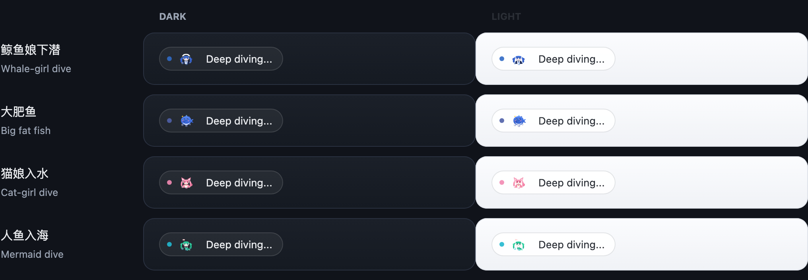
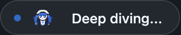
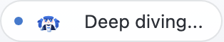
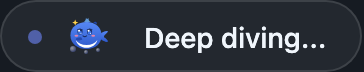
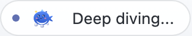
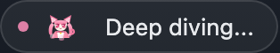
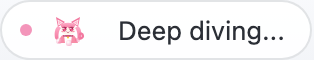
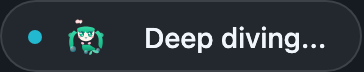
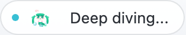

# dsh-deep-dive-skins

DSH Web GUI 状态行的「下潜前奏」皮肤插件。当官方界面显示
"Deep diving..." 状态时，把前面那个小鲸鱼喷水（或 dsh-pet 添加的装饰）
换成你选的二次元皮肤——鲸鱼娘变体、猫娘、人鱼——并配两拍叙事：
先在水面做一次准备动作的晃动，再进入带气泡上升的下潜循环。

按官方 DeepSeek Harness cordis bundle 标准构建：host 半区只注册一个设置
命名空间，浏览器半区负责挂载状态行装饰；不改任何 dsh 源码，经 profile
机制热插拔。

## 功能

- 替换原生 "Deep diving..." 状态行前的装饰
  （`[data-chat-flow] [role="status"][aria-live="polite"]`）。
- 内置四套皮肤（占位矢量图，替换 `src/client/skins.ts` 里的 SVG 即为
  正式美术）：
  - **whale** — 鲸鱼娘下潜，DeepSeek 蓝
  - **dafeiyu** — 圆滚滚的大肥鱼：靛蓝身体、白肚皮、腮红加黄色星芒
    （原创简化 SVG，风格致敬
    [dsh-reasoning-effort](https://github.com/HanaAyane/dsh-reasoning-effort)
    的 chibi 拇指鱼，MIT）
  - **catgirl** — 猫娘入水，樱花粉
  - **mermaid** — 人鱼入海，海洋青
- **随机**模式：每次状态行出现随机挑一套。
- 设置卡片（设置 -> 插件配置）：总开关、皮肤、装饰大小（14-40 px）、
  是否把 "Deep diving..." 替换成每套皮肤专属文案（跟随界面语言）。
- 与 dsh-pet 共存：装饰携带 dsh-pet working-whale 认领标记，两插件不会
  叠出两层装饰。
- `prefers-reduced-motion` 时停用动画、保持静态图形。

## 效果预览



| 皮肤 | 深色 | 浅色 |
| --- | --- | --- |
| 鲸鱼娘下潜 |  |  |
| 大肥鱼 |  |  |
| 猫娘入水 |  |  |
| 人鱼入海 |  |  |

上面的胶囊模拟 DSH 原生状态行：装饰位于 "Deep diving..." 文案之前。
重新生成截图：`node scripts/build-preview.mjs && node scripts/capture-previews.mjs`。

## 安装

从 npm 安装（发布后）：

```sh
dsh plugin --profile web add dsh-deep-dive-skins@latest
```

从仓库安装（开发调试）：

```sh
git clone <你的仓库地址> dsh-deep-dive-skins
cd dsh-deep-dive-skins
pnpm install && pnpm build
dsh plugin --profile web add link:$(pwd)
```

安装后重启 `dsh web`。link 模式下改代码后 `pnpm build` 并刷新页面即可，
无需重装。

## 兼容性

插件以 DeepSeek Harness `dsh-v0.1.1-rc.1` 作为当前开发和类型检查基线，
同时通过 peer 范围与运行时适配兼容 `0.1.0-rc.7` / `0.1.0-rc.8` Web GUI：
设置卡片遵循官方 keyed slot 契约，并在旧版 `webUiSettings` 作用域绑定器
存在时自动回退使用。

## 设置项

| 字段 | 说明 |
| --- | --- |
| 启用插件 | 总开关；关闭后完全不触碰状态行 |
| 皮肤 | 鲸鱼娘下潜 / 大肥鱼 / 猫娘入水 / 人鱼入海 / 随机 |
| 装饰大小 | 装饰高度（像素，14-40，默认 20） |
| 替换状态文案 | 把 "Deep diving..." 换成皮肤专属文案（中英跟随界面语言） |

## 工作原理

- 浏览器半区用 MutationObserver 观察状态行，认领 dsh-pet working-whale
  占用的槽位：先移除任何既有 `[data-dsh-pet-working-whale]` 装饰，再插入
  自己的 `[data-dsh-deep-dive-skin]` 装饰（同样带
  `data-dsh-pet-working-whale` 标记，dsh-pet 会跳过），React 重渲染后
  自动自我修复。
- 每套皮肤是 `src/client/skins.ts` 里的纯数据：id、名称、文案、主色与
  内联 SVG 图形（currentColor 着色）。
- 动画纯 CSS：`dds-prepare`（一次准备晃动）接 `dds-sway`（无限下潜
  循环）加上升气泡，见 `src/client/ornament.module.css`。
- 每次 DOM 变更都实时读取设置；改配置在下一次状态行渲染时生效。

## 开发

```sh
pnpm build        # tsc（类型）+ tsdown（node 半区 + 浏览器 bundle）
pnpm test         # vitest（注册、清单与 UI 行为）
pnpm typecheck    # 仅类型检查
```

浏览器 bundle 走 `window.__ModuleLoader__.load` 契约；构建预设跟随受支持
DSH 版本使用的官方 lazy-CJS 格式，并从 dsh-web-ui monorepo 复制
（`build/tsdown.client.ts` +
`build/web-platform.ts`，Apache-2.0），设置卡片外壳复制自
`shared/client/settings`。

## 路线图

- 每套皮肤换正式精灵图（替换占位 SVG）。
- 按 `/api/pet/state` 驱动分相位编排（waiting = 水面准备、thinking =
  入水、review = 上浮、done = 出水花）。
- 宠物气泡装饰资产包（decoration.json 条带），待 dsh-pet 支持
  decoration-id 选择后接入。
- 发布后登记社区插件索引（community.json PR）。

## 许可证

Apache-2.0。复制的构建/卡片文件保留 dsh-web-ui 来源声明，见文件头与
LICENSE。
