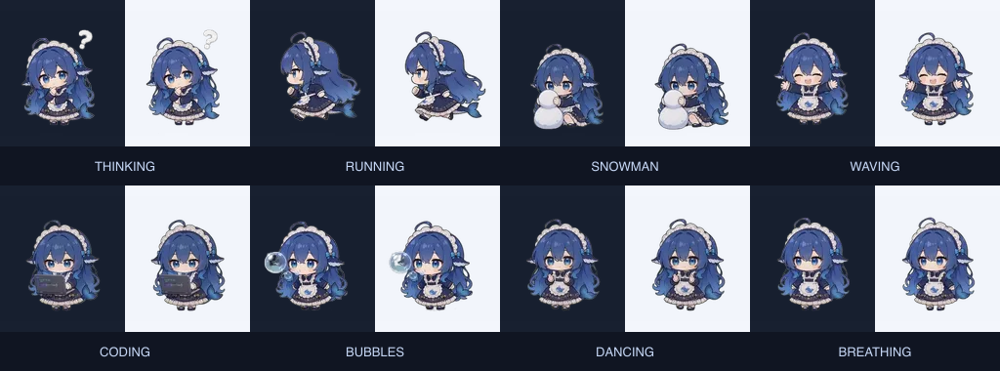

# dsh-deep-dive-skins

[English](README.md) · [下载 Release](https://github.com/skymecode/dsh-deep-diving/releases)

让蓝色大肥鱼（鲸鱼娘）陪你 Deep diving：思考、奔跑、堆雪人、挥手……
在**同一轮求索中持续切换动作**，同时保留原有四套矢量皮肤。

## 动作预览



这是素材真实帧的对照图，不是浏览器截图。执行 `pnpm preview` 可打开
交互预览：直接加载**发布 bundle 和真实设置卡片**，仅模拟 Host 存储。
可测试开始/结束求索、保存设置和卸载插件。

## 功能

- 默认蓝色大肥鱼 `whale-maid`，8 种透明动画，每段 100 帧、10fps。
- 同一轮持续轮换：思考 → 奔跑 → 堆雪人 → 挥手 → 写代码 → 吐泡泡 →
  摇摆舞 → 休闲呼吸。默认每 10 秒切换，可调至 60 秒。
- 关闭轮换后循环单个动作；`random` 模式按间隔换皮肤，不连续重复。
- 保留 `whale` 鲸鱼娘下潜、`dafeiyu` 圆滚滚大肥鱼、`catgirl` 猫娘、
  `mermaid` 人鱼四套矢量皮肤。
- 设置立即生效：开关、皮肤、14–96px 尺寸、起始动作、持续轮换、间隔、
  是否替换中英文状态文案。
- 同时识别英文 `Deep diving...` 和新版中文 `深度求索中...`。
- 系统“减少动态效果”会停用动画及轮换；后台页面暂停；求索结束或卸载后
  清理定时器、观察器、订阅，恢复原始文字。
- 使用 dsh-pet working-whale 标记避免双重装饰，关闭时恢复之前的装饰。
  不修改 Harness 源码，不依赖宠物状态服务。
- 素材随包分发，运行时不请求 GitHub 或外部 CDN。

## 安装 / 升级

直接安装 GitHub Release 包，无需 npm 发布：

```sh
dsh plugin --profile web add https://github.com/skymecode/dsh-deep-diving/releases/download/v0.2.1/dsh-deep-dive-skins-0.2.1.tgz
```

如果你使用的 profile 不是 `web`，请替换为实际名称。升级后重启 `dsh web`
并刷新页面。已有设置不会被覆盖：如果以前保存过其他皮肤或较小的尺寸，
请在「设置 → 插件配置」中选择「蓝色大肥鱼 · 鲸鱼娘」，开启「持续轮换」，
尺寸建议设为 **48–64px**。

从源码安装：

```sh
git clone https://github.com/skymecode/dsh-deep-diving.git
cd dsh-deep-diving
pnpm install --frozen-lockfile
pnpm build
dsh plugin --profile web add link:$(pwd)
```

## 兼容性

当前 SDK / 类型检查基线为官方
[`dsh-v0.1.5-rc.2`](https://github.com/deepseek-ai/deepseek-harness/releases/tag/dsh-v0.1.5-rc.2)，
即 2026-09-13 检查时的最新发布版。peer 范围接受 `0.1.5` alpha/RC 系列，
包括当时 npm `latest` 指向的 `0.1.5-rc.1`；同时保留 `0.1.3-alpha.2`、
`0.1.2-rc.1`、`0.1.1-rc.2`、`0.1.1-rc.1`、`0.1.0-rc.8` 和 `0.1.0-rc.7`。

- 设置槽位仍使用 `key: 'deep-dive-skins'`，不误用列表槽位的 `id/order`。
- 移除对已拆分的 `dsh-client-runtime` 浏览器模块，以及已移除的 Host
  `installSettingsSection` / `settingsNamespace` 导出的运行时依赖。
- Host 通过 `ctx.settings.register` 注册；客户端通过跨版本共有的
  `set/unset` 写入并回读，不混用旧 `{field}` 与新版 `{path}` 的批量接口。
- 优先使用官方 `settingsScope`；存在旧版 `webUiSettings` 绑定器时兼容回退。
  旧配置保留，新字段有默认值。

自动验证覆盖发布 factory、两套绑定器、真实 React 表单、当前 SDK Host 注册与
DOM 生命周期。28 项单元测试还覆盖实际安装的 SDK 版本、每秒更新的求索计时器
以及会话切换；另用已发布的 0.1.1-rc.2 provider 模块重新验证了 Host 注册和卸载。

发布 bundle 的预览页已通过 Tabbit 浏览器验证，覆盖动画、设置与生命周期，
其中 Host 存储为模拟实现；不代表每个历史 Harness 版本均通过完整会话端到端测试。

## 设置项

| 字段 | 取值 / 默认值 |
| --- | --- |
| 启用插件 | 开 |
| 皮肤 | `whale-maid` / `whale` / `dafeiyu` / `catgirl` / `mermaid` / `random` |
| 装饰大小 | 14–96px，默认 48 |
| 起始动作 | `think` / `run` / `snow` / `wave` / `code` / `bubbles` / `dance` / `idle` |
| 持续轮换 | 开；关闭后仍循环播放所选动作 |
| 轮换间隔 | 10–60 秒，默认 10 秒 |
| 替换状态文案 | 关；开启后跟随界面语言 |

## 开发

```sh
pnpm typecheck
pnpm test          # 行为、设置写入、keyed 注册、版本范围
pnpm build         # 类型声明 + Host ESM + 浏览器 lazy factory
pnpm test:bundle   # 发布包、真实 React 设置卡片、真实 Host SDK
pnpm test:assets   # 透明通道、帧尺寸、动画差异、体积预算
pnpm preview       # 本地交互预览
```

`scripts/import-whale-maid.mjs` 从固定上游提交复现素材，需要支持 libvpx-vp9
与 PNG 的 ffmpeg，已存在的输出会跳过。
`node scripts/build-asset-preview.mjs` 重新生成素材帧对照图。
动画由 CSS `steps(100)` 播放，每个插件挂载仅使用一个轮换计时器。
浏览器 bundle 约 4MB，内嵌全部素材，不依赖不同加载器的静态资源路径约定。

## 素材来源与许可

在 GitHub 的
[`PC2005-cloud/dsh-pet`](https://github.com/PC2005-cloud/dsh-pet/tree/e1ff8c1e4001878cbb80441262d530e16541f138)
找到了与参考图相符的蓝发鲸鱼娘动画，已从透明 VP9 视频转为 WebP 精灵条带。
插件不分发用户上传的截图。

**注意：上游素材允许开源使用，禁止商用。** 此限制适用于鲸鱼娘图片及其
在 bundle / 预览中的副本，**不属于 Apache-2.0 素材**；详见
[素材来源与许可](assets/whale-maid/NOTICE.md)，商用请联系上游作者授权。

插件代码采用 Apache-2.0。复制的构建与卡片文件保留 dsh-web-ui 来源声明，
见文件头及 [LICENSE](LICENSE)。
